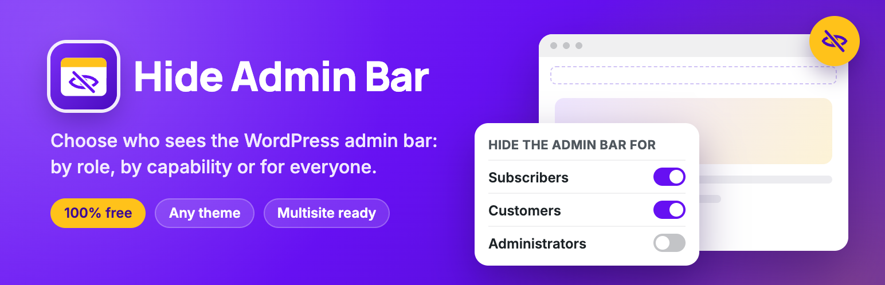

# Hide Admin Bar Based on User Roles

[](https://wordpress.org/plugins/hide-admin-bar-based-on-user-roles/)
[](https://wordpress.org/plugins/hide-admin-bar-based-on-user-roles/)
[](https://wordpress.org/support/plugin/hide-admin-bar-based-on-user-roles/reviews/)
[](https://wordpress.org/plugins/hide-admin-bar-based-on-user-roles/)
[](https://github.com/wpankit/hide-admin-bar-free/actions/workflows/coding-standards.yml)
[](https://github.com/wpankit/hide-admin-bar-free/actions/workflows/plugin-check.yml)
[](LICENSE)



Choose who sees the WordPress admin bar on the front end of your site: hide it for everyone, for logged-out visitors, for specific user roles, or for anyone with a given capability. No settings to learn and nothing added to your front end.

**[Get it on WordPress.org](https://wordpress.org/plugins/hide-admin-bar-based-on-user-roles/)** · [Support forum](https://wordpress.org/support/plugin/hide-admin-bar-based-on-user-roles/)

## Features

- **Hide for everyone:** remove the admin bar from the front end for every logged-in user.
- **Hide for logged-out visitors:** even when a plugin such as BuddyPress shows it to them.
- **Hide by role:** Subscriber, Customer, Editor, or any custom role from another plugin.
- **Hide by capability:** for anyone who has a capability, for example `edit_posts`.
- **Nothing on the front end:** no CSS, no JavaScript and no extra database queries.

Every feature is free.

## Requirements

- WordPress 5.5 or later
- PHP 5.6 or later

## Development

Clone the repository into a WordPress site's plugins folder as `hide-admin-bar-based-on-user-roles`, and install the coding standards tools:

```bash
cd wp-content/plugins
git clone https://github.com/wpankit/hide-admin-bar-free.git hide-admin-bar-based-on-user-roles
cd hide-admin-bar-based-on-user-roles
composer install
```

| Command | What it does |
|---|---|
| `composer lint` | Checks the code against the WordPress Coding Standards and PHP 5.6+ compatibility, using `phpcs.xml.dist`. |
| `composer format` | Fixes the issues that can be fixed automatically. |

### Project layout

| Path | Contents |
|---|---|
| `hide-admin-bar-based-on-user-roles.php` | Plugin header, constants and bootstrap |
| `public/` | Decides whether to hide the admin bar on the front end |
| `admin/` | The settings page under **Settings → Hide Admin Bar** and its assets |
| `includes/` | Loader, activation and translations |
| `includes/freemius/` | The Freemius SDK, used only for opt-in usage data; not checked against the coding standards |
| `languages/` | Translations |
| `.wordpress-org/` | Icon, banners and screenshots for the WordPress.org listing |
| `tools/wporg-assets/` | The script that builds those images |

Development files are marked `export-ignore` in `.gitattributes`, so they never reach the plugin zip.

### Checks on every pull request

- **Coding Standards:** PHPCS with the WordPress Coding Standards and PHPCompatibilityWP.
- **PHP Lint:** every PHP file, including the Freemius SDK, must parse on PHP 5.6 through 8.5.
- **Plugin Check:** the official WordPress.org Plugin Check, run on the plugin as it ships.

## Releasing

For maintainers:

1. In a pull request, set the new version in the plugin header, in `HIDE_ADMIN_BAR_BASED_ON_USER_ROLES` and in the `Stable tag` of `README.txt`, and add the changelog entry.
2. Merge it, then [publish a release](https://github.com/wpankit/hide-admin-bar-free/releases/new) from `main` with the tag `vX.Y.Z`.
3. The **Deploy to WordPress.org** workflow checks the three version numbers match the tag, commits `trunk` and `tags/X.Y.Z` to SVN, updates the listing assets and attaches the plugin zip to the release.

To publish readme or screenshot changes without a release, run the **Update readme and assets on WordPress.org** workflow by hand. Both workflows need the repository secrets `SVN_USERNAME` and `SVN_PASSWORD`.

## Contributing

Bug reports, ideas and pull requests are welcome. Please read [CONTRIBUTING.md](CONTRIBUTING.md) first; everyone taking part follows the [Code of Conduct](CODE_OF_CONDUCT.md).

## Security

Please report security issues privately, as described in [SECURITY.md](SECURITY.md).

## License

[GPL-2.0-or-later](LICENSE). Made by [WPAnkit](https://wpankit.com/).
